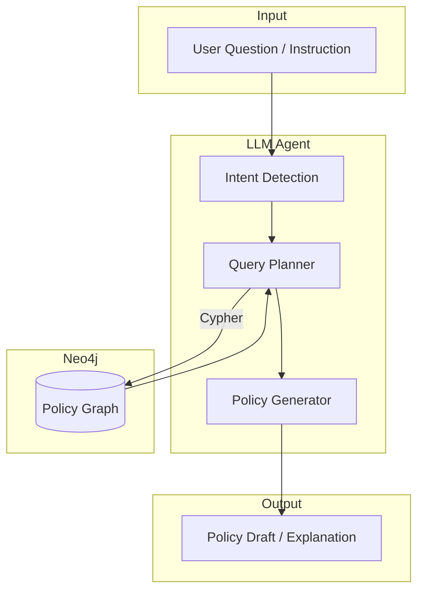

Excellent question 🙌 — you’re now at the **fun stage**: using your **Neo4j policy graph** as the knowledge base for an **LLM-driven Policy Builder** instead of relying only on vector databases.

I’ll give you a **complete project plan** that a fresher/intern can follow, broken into phases with milestones.

----------

# 🚀 End-to-End Design: LLM + Neo4j Policy Builder

----------

## 1. Problem Statement

-   Traditional **vector DB + RAG** approaches store text embeddings, but they lose the **hierarchical + relational** structure of policies (e.g., `policy → rule → action → arg → token`).
    
-   Policies have **complex dependencies** (children, attributes, parent references).
    
-   Using **Neo4j** preserves these relationships, enabling **semantic + structural queries** that an LLM can leverage when building new policies.
    

----------

## 2. System Architecture



----------

## 3. Data Flow

1.  **Data Injection (Done ✅)**
    
    -   JSON DTD → Nodes & Relationships → Neo4j Aura.
        
    -   Nodes: `Element` (policy, rule, do-_, arg-_, token-*).
        
    -   Relationships: `CHILD_OF`, `PARENT`, (future: `HAS_ATTRIBUTE`, `USES`).
        
2.  **LLM Querying**
    
    -   Instead of embedding search, the LLM generates **Cypher queries** to fetch relevant nodes and relationships.
        
    -   Example:  
        _User asks_: _“Show me all arguments supported by `do-set-local-variable`”_  
        _LLM generates_:
        
        ```cypher
        MATCH (d:Element {name:"do-set-local-variable"})<-[:CHILD_OF]-(child:Element)
        RETURN child.name, child.description;
        
        ```
        
3.  **Policy Drafting**
    
    -   LLM uses results from Neo4j to **assemble policy fragments** (rules, actions, args).
        
    -   Policies can be output as JSON, XML, or custom DSL.
        
4.  **User Iteration**
    
    -   User reviews + edits.
        
    -   LLM adjusts queries or regenerates fragments.
        

----------

## 4. Features Roadmap

### Phase 1 — **Data & Infra Setup** (Milestone 1: Week 1–2)

-   ✅ Parse `dtd_elements_tree.json` → Neo4j schema (`Element` nodes + relationships).
    
-   Build importer (already done).
    
-   Verify graph in Neo4j Browser with queries:
    
    -   All policy elements
        
    -   Children of rules/actions
        
    -   Attributes per element
        

### Phase 2 — **Neo4j Query Layer** (Milestone 2: Week 3–4)

-   Define a set of **canonical Cypher queries** for:
    
    -   Fetching policy structure
        
    -   Exploring actions and arguments
        
    -   Listing available tokens
        
-   Build a small **Python query API**:
    
    ```python
    def get_children(element_name): ...
    def get_attributes(element_name): ...
    def get_rules(policy_name): ...
    
    ```
    

### Phase 3 — **LLM Integration** (Milestone 3: Week 5–6)

-   Use LangChain / LlamaIndex / custom wrapper to:
    
    -   Accept **natural language** queries.
        
    -   Translate them into **Cypher** (via prompt templates).
        
    -   Fetch results from Neo4j.
        
    -   Pass results back to the LLM for reasoning.
        

Example Prompt Snippet:

```
You are an expert in policy graphs.
Translate user requests into Cypher queries over Neo4j.
Schema:
(:Element {name, description, content})-[:CHILD_OF|PARENT|USES]->(:Element)

```

### Phase 4 — **Policy Builder Agent** (Milestone 4: Week 7–8)

-   Implement an LLM agent that:
    
    -   Generates **new rules/policies** by querying existing structure.
        
    -   Uses Neo4j results to validate **allowed children/attributes**.
        
    -   Outputs final **policy XML/JSON**.
        

User story:

-   _“Create a rule that sets a local variable `userRole` to `admin` if attribute `title` equals `Manager`”_
    
-   LLM steps:
    
    1.  Query Neo4j: what arguments does `do-set-local-variable` support?
        
    2.  Query Neo4j: what conditions does `if-attr` support?
        
    3.  Generate a valid XML snippet:
        
        ```xml
        <rule>
          <conditions>
            <if-attr name="title" op="equal">Manager</if-attr>
          </conditions>
          <actions>
            <do-set-local-variable name="userRole">admin</do-set-local-variable>
          </actions>
        </rule>
        
        ```
        

### Phase 5 — **UI / Visualization** (Milestone 5: Week 9–10)

-   Build a **React/Angular frontend**:
    
    -   Graph view (Neo4j Bloom or custom D3.js).
        
    -   Notebook-style policy editor (like your previous monaco-editor work).
        
    -   LLM chat panel (“Ask to build policy”).
        

----------

## 5. Deliverables

1.  **Neo4j Importer** (Python script).
    
2.  **Neo4j Query API** (Python module with helper queries).
    
3.  **LLM Agent** (LangChain wrapper for Cypher generation + policy generation).
    
4.  **Policy Builder UI**:
    
    -   Graph visualization of policies.
        
    -   LLM-assisted editor.
        

----------

## 6. Intern/Fresher Milestones

Week

Milestone

Deliverable

1–2

Setup

Import JSON → Neo4j, verify queries

3–4

Query Layer

Build Cypher query functions

5–6

LLM Cypher

Natural language → Cypher (LLM prompt)

7–8

Policy Builder Agent

LLM writes policy XML using graph

9–10

UI Integration

Simple frontend with graph + chat editor

----------

## 7. Stretch Goals

-   Add `HAS_ATTRIBUTE` nodes for finer granularity.
    
-   Store actual **policy execution events** in Neo4j (for debugging).
    
-   Fine-tune an LLM on **policy DSL** for better generation.
    
-   Multi-agent setup: one agent queries graph, another validates XML, a third explains policy in plain English.
    

----------

✅ With this, you have a **clear roadmap**:

-   Graph-first storage (Neo4j).
    
-   LLM as query generator + policy writer.
    
-   End-to-end **Policy Builder** for your use case.
    

----------

👉 Do you want me to also create a **sample LangChain agent design** that translates natural language → Cypher → policy XML, so your intern has code to start with?